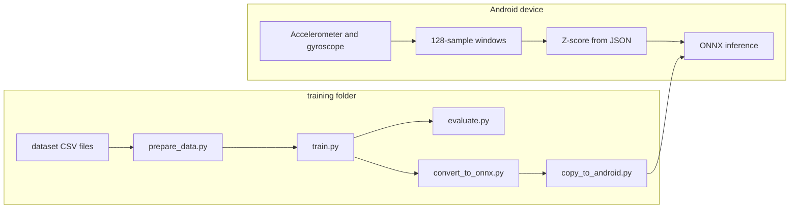

# Activity Classifier Demo

On-device **human activity recognition (HAR)** demo for Android. The phone streams accelerometer and gyroscope data at **50Hz**, builds fixed-length windows, applies the same normalization used in training, and runs a **1D CNN** using either **ONNX Runtime** (default) or **TensorFlow Lite** for inference. The app can also record **labeled** sessions and export them as CSV for rebuilding the training set.

## Repository layout

| Path | Purpose |
|------|---------|
| `app/` | Android application (Kotlin, Jetpack Compose, Hilt) |
| `app/src/main/assets/` | Bundled `har_model.onnx` (ONNX model), `har_model.tflite` (TensorFlow Lite model), and `normalization_params.json` |
| `training/` | Python pipeline: data prep, training, evaluation, ONNX export, copy to assets |
| `training/dataset/` | Sample CSV recordings and `activity_labels.txt` |

## Android app

- **Application ID:** `com.example.activityclassifierdemo`
- **Min / target SDK:** 29 / 36 (`compileSdk` 36 with minor API 1)
- **Stack:** Jetpack Compose, Hilt, ViewModel, ONNX Runtime Android (`com.microsoft.onnxruntime:onnxruntime-android`), TensorFlow Lite, and `org.json` for normalization parameters

**Main behavior**

- Sensor pipeline collects data at **50Hz** and produces **8** features per timestep: `acc_x/y/z`, `gyro_x/y/z`, `acc_mag_sq`, `gyro_mag_sq` (aligned with training).
- Classification uses windows of **128** samples (with overlap consistent with the training pipeline).
- **Training mode** records timestamps and labels, then exports CSV (via `FileProvider`) into `training/dataset/` for the Python tooling.

### Build and run

1. Open the project root in **Android Studio** (Kotlin DSL Gradle; AGP 9.x, Kotlin 2.3.x).
2. Run the `app` configuration on a device or emulator **API 29+**.

From the project root:

```bash
./gradlew :app:assembleDebug
./gradlew :app:installDebug   # with a device or emulator connected
```

## Python training (`training/`)

End-to-end flow:

1. **Collect or add CSVs** under `training/dataset/` (see data format below).
2. **`prepare_data.py`** — load CSVs, build sliding windows (length **128**, step **64**), majority label per window, **70% / 15% / 15%** train/val/test split (per class, seed **42**), Z-score using train statistics only, write `processed_data/processed_data.npz` and `processed_data/normalization_params.json`.
3. **`train.py`** — train `HAR_CNN1D`, save `model/har_cnn1d.pth`, update `model/training_plots.png`.
4. **`evaluate.py`** — test-set metrics (classification report, confusion matrix) using the checkpoint and label names from `normalization_params.json`.
5. **`convert_to_onnx.py`** — export `model/har_model.onnx` (input name `input`, shape `(batch, 128, num_channels)`; output logits `output`), validate with ONNX Runtime.
6. **`copy_to_android.py`** — copy ONNX (and `har_model.onnx.data` if present) plus `normalization_params.json` to `app/src/main/assets/`.

Run from the `training` directory:

```bash
cd training
python -m venv .venv
source .venv/bin/activate   # Windows: .venv\Scripts\activate
pip install -r requirements.txt
# Scripts also use pandas, scikit-learn, matplotlib, and onnxruntime; install if missing:
pip install pandas scikit-learn matplotlib onnxruntime

python prepare_data.py
python train.py
python evaluate.py
python convert_to_onnx.py
python copy_to_android.py
```

The checked-in `requirements.txt` lists core numerical/ONNX-related packages; **`prepare_data.py`**, **`evaluate.py`**, **`tools/graph.py`**, and **`convert_to_onnx.py`** depend on **pandas**, **scikit-learn**, **matplotlib**, and **onnxruntime** respectively. **`onnx-tf`** / **TensorFlow** in `requirements.txt` are not required by the current export path (PyTorch → ONNX).

### Data format (CSV)

Header:

`timestamp,acc_x,acc_y,acc_z,gyro_x,gyro_y,gyro_z,acc_mag_sq,gyro_mag_sq,label_id`

Label names are defined in `training/dataset/activity_labels.txt` (example: `0 STANDING`, `1 WALKING`, `2 JUMPING`).

### Model summary

- **Architecture:** `training/model/har_cnn1d.py` — 1D convolutions over time, global pooling, fully connected head; logits (no softmax in the exported graph).
- **Mobile assets:** `har_model.onnx` (default) or `har_model.tflite` along with `normalization_params.json`. These must stay in sync with the training configuration (feature order, mean, std, and class count).

### Inference Backend

The Android app supports two inference runtimes:
- **ONNX Runtime** (default): uses `har_model.onnx` with NNAPI acceleration.
- **TensorFlow Lite**: uses `har_model.tflite` with NNAPI acceleration and 4 CPU threads.

The backend is selected at compile time in `app/src/main/java/com/example/activityclassifierdemo/di/InferenceModule.kt` by setting `SELECTED_BACKEND`. The provided Python training pipeline exports the ONNX model; for TensorFlow Lite, an additional conversion step would be needed (not currently included).

## Workflow overview



Recording labeled data on the app produces CSV files that feed `prepare_data.py`; after training and export, `copy_to_android.py` refreshes the assets the app loads at runtime.
